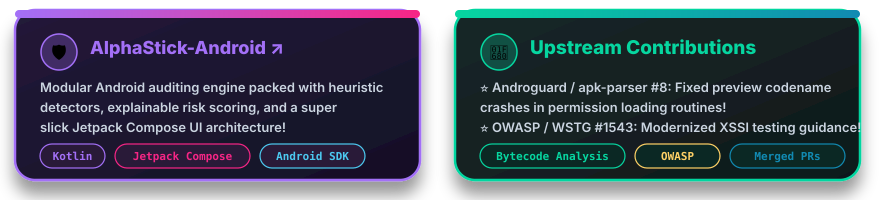

# T Shivanesh Kumar

[+🚀;Actively+learning+Front+End+Development+🎨;Open+Source+Contributor+%40+Androguard+%26+OWASP+⭐)](https://git.io/typing-svg)

 

&nbsp;

&nbsp;

  

## About Me

Cybersecurity Engineer and Android Developer passionate about system-level security, reverse engineering, and building resilient software—specializing in Android security internals, static/dynamic APK inspection, and network intrusion analysis, while actively expanding into modern Front End Development and contributing upstream to open-source security tools.

 

  

---

## Projects, Contributions & Activity

  
  

 

  <picture>
    <source media="(prefers-color-scheme: dark)" srcset="https://raw.githubusercontent.com/tshivaneshk/tshivaneshk/output/github-contribution-grid-snake-dark.svg">
    <source media="(prefers-color-scheme: light)" srcset="https://raw.githubusercontent.com/tshivaneshk/tshivaneshk/output/github-contribution-grid-snake.svg">
    
  </picture>

---

## Tech Stack

---

  Built by <a href="https://github.com/tshivaneshk">T Shivanesh Kumar</a>

