<div align="center">



</div>

I am an engineer focused on **security research and software systems**. Most of my work sits at the intersection of Android internals, binary reverse engineering, and defensive tooling—motivated by understanding how software behaves under conditions its authors didn't anticipate.

---

### Currently Building

- **Android Security & Forensics Suite**  
  A desktop analysis tool connecting directly over ADB to audit application sandbox boundaries, inspect dynamic service interactions, and surface vulnerabilities without external overhead.

---

### Selected Work

- **[Wolfsniff](https://github.com/tshivaneshk/Wolfsniff)**  
  Hybrid network intrusion detection engine pairing a native C packet capture core with flow classification on the UNSW-NB15 dataset.

- **[AlphaStick-Android](https://github.com/tshivaneshk/AlphaStick-Android)**  
  Modular Android security auditing tool built with Kotlin and Jetpack Compose for heuristic threat analysis and explainable risk scoring.

- **[ropelog-engine](https://github.com/tshivaneshk/ropelog-engine)**  
  Real-time log ingestion and streaming engine utilizing a Treap-based Rope data structure in C++ for efficient chunk indexing.

---

### Open Source

- **[Androguard (apk-parser)](https://github.com/androguard/apk-parser/pull/8)**  
  Investigated and resolved an issue where Android preview SDK codenames broke permission table parsing—building a unified resolver and regression suite upstream.

- **[OWASP WSTG](https://github.com/OWASP/wstg/pull/1543)**  
  Refactored testing guidance for Cross-Site Script Inclusion (XSSI) to deprecate legacy browser techniques and align with modern defense standards.

---

### Technologies

```text
Languages     Python · Kotlin · C / C++ · Rust
Systems       Android (AOSP/Internals) · Linux · ADB · Git · Docker
Security      Ghidra · Frida · JADX · APKTool · Androguard · Wireshark
Full Stack    TypeScript · React · Next.js (Actively Expanding)
```

---

### Connect

[Portfolio](https://portfolio-rho-sooty-uwjqzmzrhi.vercel.app/) &nbsp;·&nbsp; [LinkedIn](https://www.linkedin.com/in/tshivaneshk/) &nbsp;·&nbsp; [Repositories](https://github.com/tshivaneshk?tab=repositories)
