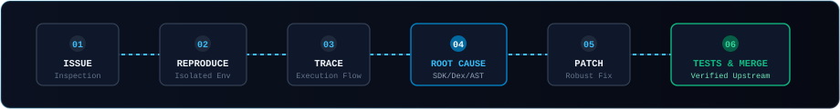

<div align="center">



<br/>

[](https://portfolio-rho-sooty-uwjqzmzrhi.vercel.app/)
&nbsp;
[](https://www.linkedin.com/in/tshivaneshk/)
&nbsp;
[](https://github.com/tshivaneshk?tab=repositories)

<br/>

</div>

---

### System Status

```ini
[SYSTEM STATUS // TELEMETRY]
CURRENT ROLE    : Cybersecurity Engineer & Android Developer
FOCUS DOMAINS   : Android Internals, Binary Reverse Engineering, Network Intrusion Detection
ACTIVE RESEARCH : Desktop Android Forensics Engine (USB/ADB-driven, static/dynamic/runtime inspection)
OPEN SOURCE     : Androguard Core Contributor (APK parser bytecode & preview codename resolver)
CONTINUOUS ED   : Modern Front-End Engineering & Systems Architecture
CORE RUNTIMES   : Linux (Debian/Arch), Android OS, Windows
HEALTH STATUS   : RUNNING // COMPILED SECURE
```

---

### Engineering Profile

I approach software engineering with an adversary's mindset and a builder's discipline. Rather than accepting software abstractions at face value, I inspect runtime memory, dissect compiled bytecodes, and analyze raw network traffic to determine how systems behave under stress or exploitation.

- **Defensive & Offensive Systems**: Developing automated security tooling for Android runtime inspection, static heuristics, and heuristic packet-flow classification.
- **Deep-Dive Engineering**: Passionate about root-cause debugging—stepping through AXML parsers, Android manifest schema quirks, and native Linux socket capture loops.
- **Continuous Expansion**: Actively advancing in modern front-end engineering and full-stack systems to build clear, responsive security telemetry dashboards and client interfaces.

---

### Currently Building

#### 01. Android Security & Forensics Platform
> Desktop security analysis suite that directly interfaces with Android devices over ADB to execute comprehensive threat and runtime evaluations without machine learning overhead.

- **Static Inspection**: Deep-scans installed APKs, manifest intent-filters, exported services, dangerous permission matrices, and hardcoded secrets.
- **Dynamic & Behavioral Monitoring**: Attaches to live devices to trace foreground processes, inspect background daemons, analyze network sockets, and monitor file system mutations.
- **Reporting Engine**: Synthesizes granular security findings, CVE cross-references, and actionable risk matrices into deterministic vulnerability reports.
- *Stack*: Python, ADB, Linux/Windows Subsystems, Android Debug Protocol.

---

#### 02. [Wolfsniff](https://github.com/tshivaneshk/Wolfsniff) — Hybrid Network Intrusion Detection System
> High-throughput Network IDS combining high-speed native C packet ingestion with machine learning classification for automated threat detection.

- **Engine Architecture**: C-optimized raw packet capture pipeline passing continuous flow features to an inference engine.
- **Machine Learning**: Random Forest classifier trained on the UNSW-NB15 benchmark dataset for anomalous flow recognition and zero-day signature heuristics.
- **Defense Mapping**: Maps classified network telemetry directly against MITRE ATT&CK tactical matrices.
- *Stack*: C, Python, Scikit-learn, PCAP, Network Sockets.

---

#### 03. [AlphaStick-Android](https://github.com/tshivaneshk/AlphaStick-Android) — Modular Android Security Auditing Engine
> On-device and workstation-assisted Android security scanner built to deliver explainable vulnerability scoring and false-positive aware detections.

- **Heuristic Auditing**: Evaluates app sandboxes, broadcast receivers, cryptographic implementations, and dynamic code loading (DCL) routines.
- **Modern Architecture**: Clean MVVM architecture built natively in Kotlin and Jetpack Compose.
- *Stack*: Kotlin, Jetpack Compose, Android SDK, Security Heuristics.

---

### Open Source Engineering

I actively contribute upstream to production security frameworks and industry standards. My focus is on resolving complex edge-cases in parsers and specifications.

#### Upstream Contributions

- **[Androguard / apk-parser (PR #8)](https://github.com/androguard/apk-parser/pull/8)** — *Merged*
  - **Issue #3 Investigation**: Diagnosed recurring parsing failures where APKs with letter-based preview codenames (e.g. Android `Q`) caused fatal `ValueError` crashes in permission loading routines.
  - **Root-Cause Resolution**: Built a centralized SDK codename-to-API level translation engine preserving fallback models, updating permission SDK comparisons, and adding regression tests.
- **[OWASP / Web Security Testing Guide (PR #1543)](https://github.com/OWASP/wstg/pull/1543)** — *Merged*
  - **Refactoring & Accuracy**: Modernized the Cross-Site Script Inclusion (XSSI) methodology (WSTG-CLNT-13), removing obsolete legacy browser artifacts while preserving modern SameSite defensive criteria.

<br/>

<div align="center">
  
</div>

<br/>

---

### Technical Specialization

```
REVERSE ENGINEERING & SECURITY
  Ghidra · Frida · JADX · APKTool · Androguard · MobSF · Burp Suite · Wireshark · ADB

LANGUAGES & RUNTIMES
  Python · Kotlin · C / C++ · Java · TypeScript · JavaScript · Shell (Bash/Zsh)

SYSTEMS & PLATFORMS
  Linux Internals · Android Framework (AOSP) · Windows Subsystems · Git · Docker

FRONT END & FULL STACK (ACTIVELY EXPANDING)
  React · Next.js · Modern Front-End UI Architecture · REST APIs · TailwindCSS

DATA & APPLIED ML
  Scikit-learn · NumPy · Pandas · UNSW-NB15 Benchmark Analysis · Random Forest Classifiers
```

---

### Operating Philosophy

```
1. VERIFY AT RUNTIME
   Never trust abstraction layers or high-level assumptions. Inspect the actual assembly,
   bytecode, and network packets.

2. ROOT-CAUSE BEFORE PATCHING
   Never mask symptoms with try/except blocks. Trace the defect back to its original
   state mutation or parsing anomaly.

3. SECURITY IS A SYSTEM PROPERTY
   Security cannot be sprinkled on top of a broken design. It must be woven into the
   architecture, memory management, and permission boundaries.

4. AUTOMATE REPETITIVE AUDITS
   If a manual security audit workflow has to be executed more than twice, build a
   deterministic tool to execute and report it.
```

---

### Telemetry & Activity

<div align="center">
  
  
</div>

<br/>

<div align="center">

<picture>
  <source media="(prefers-color-scheme: dark)" srcset="https://raw.githubusercontent.com/tshivaneshk/tshivaneshk/output/github-contribution-grid-snake-dark.svg">
  <source media="(prefers-color-scheme: light)" srcset="https://raw.githubusercontent.com/tshivaneshk/tshivaneshk/output/github-contribution-grid-snake.svg">
  
</picture>

</div>

---

<details>
  <summary><b>[+] INSPECT DIAGNOSTIC CONSOLE // EASTER EGG</b></summary>
  <br/>
  
  ```bash
  $ sec-terminal --target tshivaneshk --verbose
  [+] Handshake initialized with origin https://github.com/tshivaneshk
  [+] Cryptographic signature: SHA256-VALIDATED
  [+] Status: Available for security research, systems collaboration, and defensive engineering.
  [+] Echo: "Knowledge comes from breaking things down to assembly."
  ```
</details>

<br/>

<div align="center">
  <sub>Engineered by <strong>T Shivanesh Kumar</strong> • Cryptographically verified code on GitHub</sub>
</div>
